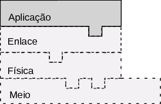

{ width=40% }

# Introdução

Protocolos de comunicação são criados para definir um meio de comunicação entre dois ou mais pontos, esses protocolos funcionam como "linguagens" que devem ser seguidas para que ambos os agentes da comunicação troquem dados de forma confiável e eficiente. Para isso, deve-se inserir uma série de artifícios para garantirmos que a mensagem será corretamente enviada e recebida.

Os meios de comunicação pelo quais as mensagens trafegam não são muitos confiáveis e inserem erros na transmissão, esses erros devem ser minimizados (zerados) a fim de garantirmos uma transmissão confiável entre dois pontos.

Ninguém gosta de trabalhar com a ideia de poder ter uma foto recebida por e-mail corrompida, quando enviamos um e-mail, pressupomos que o receptor receberá a mensagem tal como foi enviada. Para isso a mensagem de e-mail passa por uma série de "tratamentos" a fim de garantir sua integridade. Além disso os diferentes serviços de e-mails (tais como gmail, outlook, ...) devem conseguir enviar e
receber e-mail entre si, para isso, devem concordar com o formato que essa mensagem será formatada.

```
Questão :
    - Qual é o protocolo utilizado para troca de email entre
    os servidores?
```

```
Questão :
    - Quais são os protocolos de envio e recebimento de email
    entre client - servidor de emails ?
```

## Client-Server

Com o objetivo de estabelecer uma comunicação entre dois pontos distintos, devemos estabelecer papeis (rolls) para cada nó da comunicação. Um modelo muito utilizado é o do *client*/*server* (que será desconstruído depois na disciplina de *cloud, 6 semestre*). Nesse modelo, concentra-se funções específicas para ambos os nós: o server possui um papel passivo e centralizador onde aguarda a comunicação de um/ ou múltiplos clients (ativos) [[ref_1]](https://en.wikipedia.org/wiki/Client%E2%80%93server_model).

{ width=50% }

Podemos citar como utilização dessa topologia os serviços de email, impressão, e toda internet (www). Como alternativa ao modelo client-server, existem os serviços chamados : *peer-to-peer*, onde todos os recursos estão decentralizados em uma rede (exe: torrent).

```
Questão :
    - Faça um breve descritivo do que acontece quando você faz uma busca
    de rota no Waze, pontue os papeis do client e do server.
```

```
Questão :
    - Faça o diagrama de uma rede peer-to-peer
```

```
Questão :
    - Existem modelos de rede híbridos ? De exemplos de funcionamento.
```

