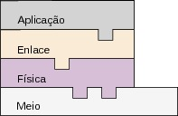
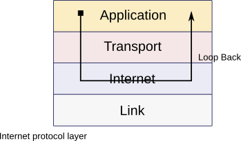
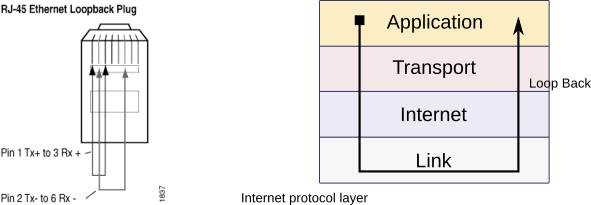
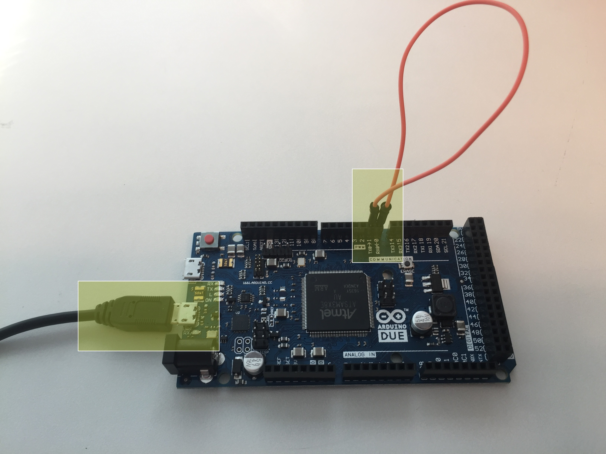
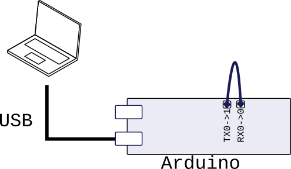
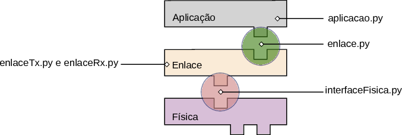
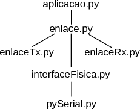

{ width=50% }

# Modo de comunicação - LoopBack

Conexões loopback são muito utilizadas para a validação e teste de comunicação, nessa topologia os dados de saída (TX) são conectados a sua própria entrada (RX) permitindo que os dados enviados possam ser lidos pelo memso nó. Existem [loopbacks](https://en.wikipedia.org/wiki/Localhost) em diversos níveis do protocolo, por exemplo: quando acessamos o endereço ttp://localhost (ou 172.0.0.1) no navegador estamos executando um loopback na camada IP, como ilustrado a baixo : 

Loobacks também podem ser executados na camada mais baixa da comunicação, para isso, deve-se conectar fisicamente a saída da placa de rede a sua entrada. No caso de um loopback físico de uma conexão Ethernet (via cabo de rede), deve-se modificar um cabo para que a saída (TX) seja ligado a sua entrada (RX), como ilustrado no diagrama a seguir : 

## Loopback serial

No nosso projeto, utilizamos o Arduino como placa de rede, e o protocolo UART como forma de comunicação entre dois nós. O loopback nesse caso se da conectando a saída da porta UART (TX0) a entrada da porta UART (RX0), assim todo dado que for transmitido pelo computador, será encaminhado para a porta TX0 e recebida pela porta RX0 e então devolvido ao computador pelo USB.

## Conexão :

- Conectar o TX0 (pino 1) no RX0 (pino 0)
- USB perto da fonte

# Código base

O código possui os seguintes arquivos : aplicacao.py; enlace.py; enlaceTx.py; enlaceRx.py; interfaceFisica.py. Sendo cada um responsável por :

- aplicacao.py : Carrega uma imagem e a transmite via enlace. Após a transmissão recebe novamente a imagem e a salva em imgs/recebida.png

- enlace.py : Interface de comunicação entre a aplicação e o enlace.

- enlaceTx.py : parte do enlace responsável por transmitir n dados via a camada física (interfaceFisica.py)

- enlaceRx.py : parte do enlace responsável por receber n dados via a camada física (interfaceFisica.py)

- interfaceFisica.py : Código que lida com o envio dos dados para o Arduino e recebimento.

A figura a seguir faz uma relação dos códigos com cada etapa da comunicação a ser desenvolvida :

Com a seguinte árvore de dependência :

{ width=35% }

## Threads 

Para haver transmissão e recepção simultâneamente o código faz uso de threads, uma para enlaceTx e outra para o enlaceRX possibilitando que a interface enlace transmita e receba dados de forma contínua.

## Porta serial !

A 
